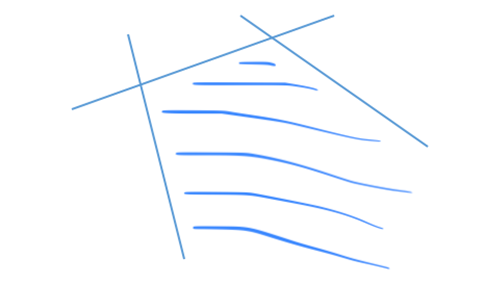
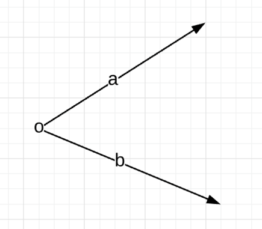

# 第2章 线性规划的几何原理

作者：孙睿晗，荷兰阿姆斯特丹大学 人工智能硕士研究生在读

研究方向：强化学习，元学习，贝叶斯优化

本章节，我们将从几何的角度认识线性规划问题，主要介绍凸集，极点，极方向，空间多面体，超平面等概念。

## 2.1 凸集

### 2.1.1 凸集定义

如果一个集合$C$是凸集,那么我们可以说，对于集合内任意两点$x$、$y$，$z=\theta x+（1-\theta)y$ 也在$C$里面。注意到，当$\theta$等于0的时候，$z = y$, 当$\theta$等于1的时候, $z = x$, 也就是说从几何角度来理解z是一条连接$x$和$y$的线段。从这种角度来理解凸集，我们可以想象对于凸集内任意两点的连线仍在此凸集内。如下两幅图可以很直观的说明这个概念。 

  

​                  图2.1 正五边形                                                             图2.2 五角星

对于图2.2五角星来说，存在两点，它们之间的连线并不在五角星内，所以五角星不是凸集。而图2.1正五边形则很明显是一个凸集。

### 2.1.2 Lemma引理

已知$S_1,S_2$是两个凸集，那么：

$S_1\cap S_2$是凸集

$S_1 \oplus S_2=\{x_1+x_2:x_1\in S_1, x_2\in S_2 \}$是凸集

$S_1 \ominus S_2=\{x_1-x_2:x_1\in S_1, x_2\in S_2 \}$是凸集

### 2.1.3 凸壳（Convex Hull）

为了定义凸壳，首先我们需要知道什么是凸组合（convex combination），类似于凸集的定义，凸组合定义如下：
$$
x=\sum_k  \lambda_kx_k \\
\sum_k \lambda_k=1 \\
\lambda_k\ge 0, \forall k
$$
也就是说只要变量前的系数相加为1且都为非负，我们就有了一个凸组合。现在，我们可以定义凸壳了。

**凸壳定义：**对于一个集合$S\in R^n$, $S$的凸壳$conv(S)$是$S$内所有元素的凸组合的集合。即如果$x\in conv(S)$,那么$x$可以表示为$S$内$k$个元素的凸组合：
$$
x=\sum_k  \lambda_kx_k \\
\sum_k \lambda_k=1 \\
\lambda_k\ge 0, \forall k \\
x_k\in S,\forall k
$$

## 2.2 空间多面体

### 2.2.1 空间多面体(Polyhedron)

因为空间内任何线性不等式$a_j^T x\le b_j$可以将空间分为两个部分，所以我们统称线性不等式为**halfspaces**。同样对于任意线性等式$a_q^Tx=b_q$可以在空间内定义一个“平面”，这在三维空间很好想象，因为它就是一个平面的解析式，但在高维空间我们叫“平面”为“超平面”。则空间多面体就是有限个**halfspaces**和超平面的相交部分，数学语言来表示为：
$$
P=\{\pmb{x}|\pmb{a_j^Tx}\le b_j,j=1,...,p; \pmb{a_q^Tx}=b_q,q=1,...,m \}
$$
我们还可以把$P$写成矩阵-向量的形式：
$$
P=\{\pmb{x}|A\pmb{x}\le \pmb{b}, C\pmb{x}=\pmb{d}\}
$$
这里的$x,b,d$ 均为向量，$A$和$C$是两个矩阵。我们可以证明任何空间多面体都是凸集，只需要在$P$中任取两点$x$和$y$，然后证明$x,y$的凸组合（convex combination）$z\in P$即可，在此不赘述。

图2.3 二维空间的空间多面体（阴影部分）

### 2.2.2 多面体和锥(Polytopes and Cones)

多面体就是一个有界的空间多面体，也就是说多面体是空间多面体的一个特殊情况，空间多面体会出现有界限、无限延伸的情况，但多面体不会（见图2.4）。

锥，顾名思义，几何上理解就是一个没有棱的圆形金字塔（见图2.5），接下来我们谈谈锥的数学定义。

**定义**：如果$x\in C$，对于任何 $λ\ge0$，$λx\in C$。

  

​                      

​           图2.4 多面体为有界空间多面体         图2.5 两条从原点引出的射线组成一个锥

类似于凸集有凸组合(convex combination)，锥也有锥组合(conic combination)。$k$个$n$维向量$x_k$的锥组合可以写为： 
$$
Z=\lambda_kx_k, \lambda_k\ge0,\forall k
$$
注意在这里我们并不要求$\lambda$为0到1之间的数，因为我们需要保留“锥”的特征。所有锥内部元素的锥组合所构成的集合我们称之为凸锥(convex cone)，从名字我们不难猜测，凸锥的定义就是它即是一个锥，又是一个凸集。如果$x$在凸集$C$中，那么$x$所有的锥组合仍属于$C$，反之，如果$C$是凸锥，那么$C$ **包含**其所有元素的锥组合。这里我们需要将凸锥的概念与**凸壳(convex hull)**区分开来，凸壳是凸锥的一个子集。凸锥**包含**锥所有元素的锥组合，而凸壳则刚刚好**等于**锥所有元素的锥组合。

## 2.3 极点与极方向

### 2.3.1 极点与极方向

在这一部分我们来谈一谈极点的概念，首先直观上理解极点就是空间多面体的“顶点”，其数学定义有一些抽象，但与我们的直观理解并不冲突。

**定义：**对于任意凸集$S$，$S$内一向量$\pmb{x}$如果是$S$的极点，那么不存在不同于$\pmb{x}$的两个向量 $\pmb{y},\pmb{z}$，使得$\pmb{x}=\lambda \pmb{y}+(1-\lambda)\pmb{z},0\le \lambda \le 1$。

有了极点的定义后，我们来定义凸集的极方向。首先我们考虑什么是凸集的“方向”，通俗一点讲就是给定一个$S$内的起始点，然后沿着这个方向无论走多远我们依旧会落在原来的凸集$S$内。而极方向的定义我们可以和极点联系起来，简单来说就是极方向不能是凸集内另外两个不同方向的锥组合。这里的锥组合就是线性组合，只不过系数均为正，而$\pmb{a,b}$不同方向意味着$\pmb{a}\neq k\pmb{b}$。如果把在凸集中极方向的定义映射回几何学中，就是空间多面体的边，但注意应是**无限延长的边**，对于那些有限长度的边，并不符合极方向的定义。

图2.6  o为极点，a,b为锥的两个极方向

### 2.3.2 极点的特性

对于一个空间多面体$P$, 已知$x^* \in P$, 那么以下三个条件为等价条件：

$x^*$是 $P$ 的一个顶点(vertex)。

$x^*$是 $P$ 的一个极点(extreme point)。

$x^*$是$P$的一个基本可行解(basic feasible solution)。

证明这个定理的思路是先证明$1\Rightarrow 2$,然后证 $2 \Rightarrow 3$,最后证 $3\Rightarrow 1$，通过这么一个循环，我们可以得到1，2，3为等价条件。我将给出$1\Rightarrow 2$的简要证明思路，有兴趣的读者可以查询Bertsimas. et al[1]。首先让我们定义什么是空间多面体的顶点，如果$x$是$P$ 的顶点，那么对于$P$内任意不同于$x$的点$y$，一定存在$c$使得$cx < cy$。现在让我们假设$x^*\in P$是$P$的顶点，那么一定存在$y\neq x,z\neq x \quad s.t. cx<cy,cx<cz$。整理一下可得$cx < c(y+z)$。又可以知道对于$0\le \lambda \le 1$，$\lambda cx<\lambda cy, (1-\lambda) cx<(1-\lambda) cz\Rightarrow  cx<c(\lambda y+(1-\lambda)z)$。即$x\neq \lambda y+(1-\lambda)z$, 也就是说$x$是$P$的极点，证毕。

 这个定理对我们的意义在于求解线性规划问题可以直接找空间多面体的顶点，因此省去了很多不必要的麻烦。其实后期可以证明线性问题的至少一个最优解一定会出现在顶点上，这也是单纯形法(simplex method)背后的主要思想。

## 2.4 超平面

**超平面定理（Hyperplane Theorem）**

Hyperplane Theorem是凸集中最基本的定理之一，其主要内容如下：

**定理 1**：$C,D\in R^n$ 为两个不相交的凸集,那么存在$a\in R^n,a\neq0, b\in R$可以使得$\forall x \in C, a^Tx\le b$以及$\forall x\in D,a^Tx\ge b$。

**定理 2**：$C,D\in R^n$ 为两个不相交的闭凸集,那么存在$a\in R^n,a\neq0, b\in R$可以使得$\forall x \in C, a^Tx< b$以及$\forall x\in D,a^Tx> b$。

定理2是定理1的一个特殊情况。定理2中这条可以将$C, D$分开的直线可以简单定义为$C, D$的垂直平分线。

## 本章参考文献

[1] Dimitris Bertsimas and John Tsitsiklis. Introduction to Linear Optimization.Athena Scientific, 1st edition, 1997.

[2] Mokhtar S. Bazaraa. Nonlinear Programming: Theory and Algorithms. Wiley Publishing, 3rd edition, 2013.

[3] Stephen Boyd and Lieven Vandenberghe. Convex Optimization. Cambridge University Press, New York, NY, USA, 2004.