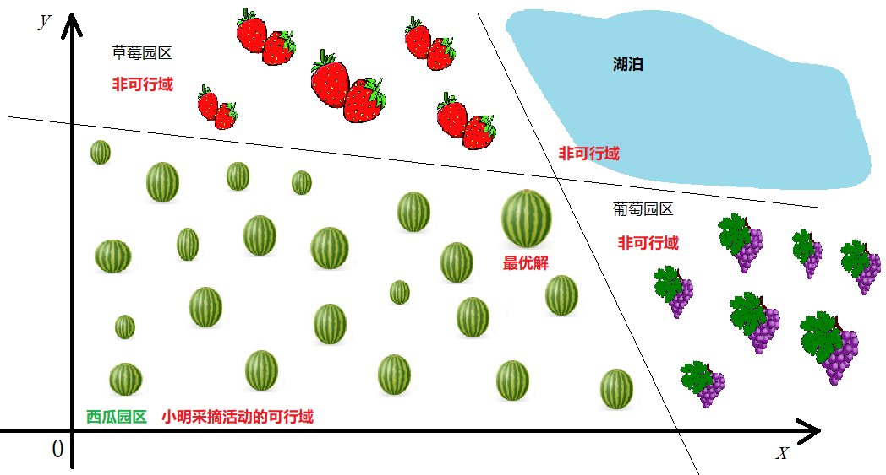
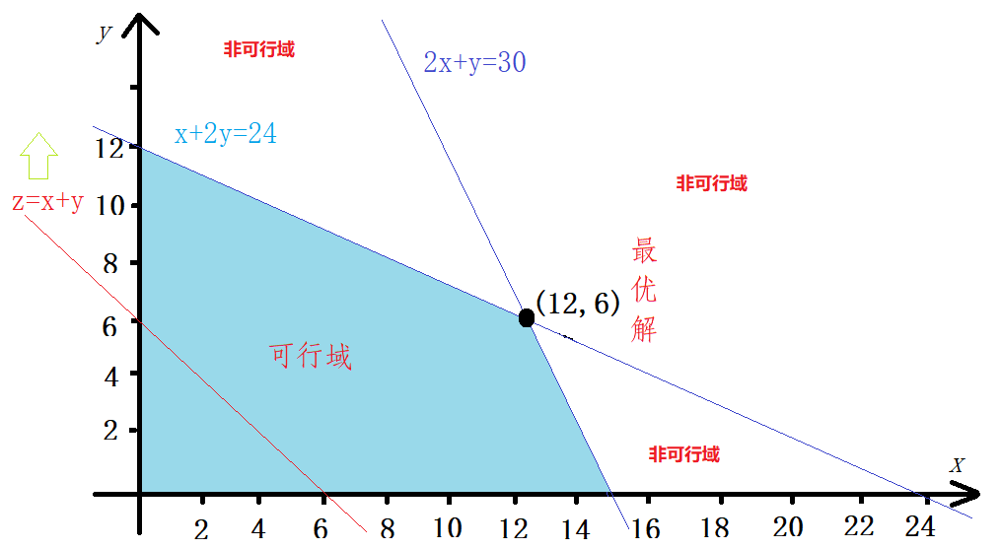
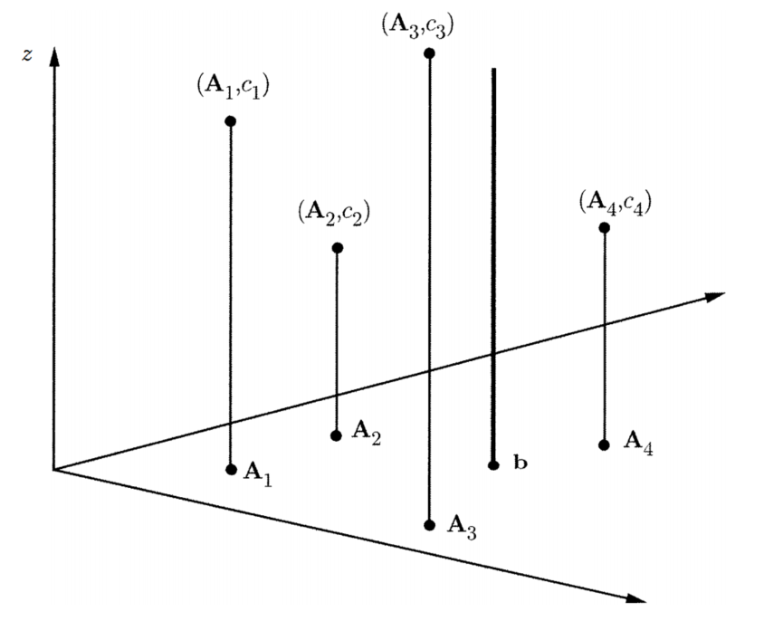
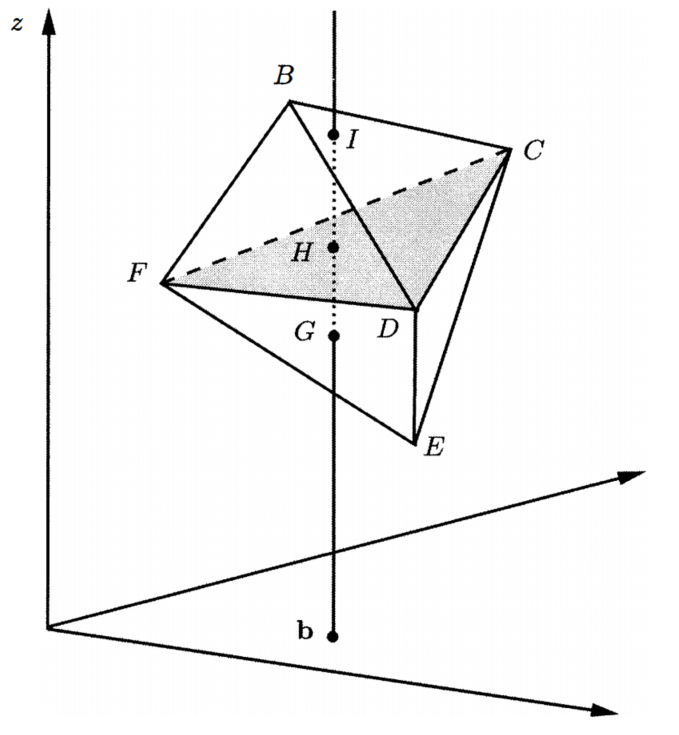
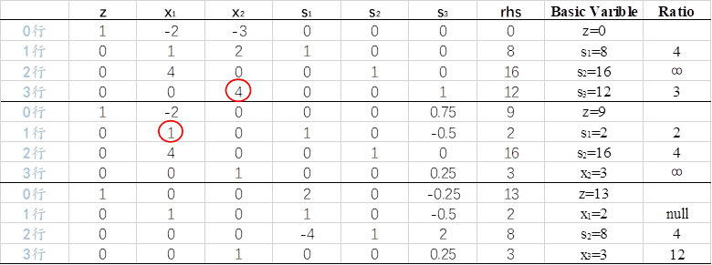
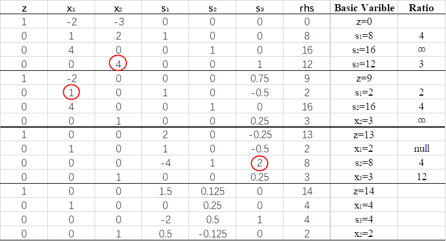
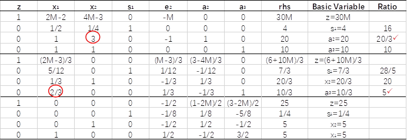
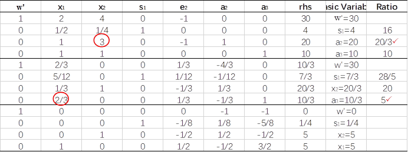

# 第3章 单纯形法
作者：臧永森，清华大学 工业工程系 在读博士，戚铭尧老师团队

研究方向：运筹优化算法设计与应用、数据统计分析、大数据技术与应用、鲁棒优化

通过前面两章的介绍，相信大家已经对线性规划有了比较深入的理解，本章将介绍一种求解线性规划比较经典的算法，即单纯形法。单纯形法由美国数学家George Bernard Dantzig在1947年担任美国空军司令部数学顾问时提出，旨在解决空军军事规划问题，之后成为解决线性规划问题比较通用的有效算法。Dantzig在1953年又提出了改进单纯形法，目的是降低迭代过程中的累积误差；美国数学家Carlton Edward Lemke于1954年提出对偶单纯形法，来解决原问题难以求解，但是对偶问题方便求解的问题。这些变形单纯形法都基于基础单纯形法，本章主要介绍基础的单纯形法。

## 3.1 可行域与最优解

谈线性规划问题目的就是要进行求解获取最优解，要理解最优解就不得不提可行域，可行域和最优解是线性规划问题中最为重要的两个概念。

线性规划问题的**可行域**指的是满足线性规划问题所有约束条件（包含符号约束等各种约束）的所有点的集合，每个点叫做可行解。**最优解**是指可行域中使得目标函数取得最小值（对于最小化问题）或最大值（对于最大化问题）的某一个或某些点，相应的函数值就是最优值。

用一个比较生动的例子来解释上述两个概念：假设某个周末小明来到采摘园享受轻松时光，采摘园有三块相邻的采摘区，分别属于三家农户：老张、老李、老王，老张种了草莓，老李种植的西瓜，老王则种植了葡萄，虽然三块采摘区相邻，但三家农户分别做自己的生意互不相往来。小明决定到老李家采摘西瓜，老李做生意的规定是：每位顾客只能进入园区一次，只能吃或者带走一个西瓜，进入园区的门票是20元人民币。

当小明进入老李的西瓜园区后，就可以来分析我们的可行域和最优解了。虽然老李家的西瓜园区与隔壁的草莓园区、葡萄园区相邻，但是小明是不可以进入草莓园区和葡萄园区进行采摘的，因为他买的是老李家的门票，而草莓园区和葡萄园区不属于老李，如果进入草莓园区或者葡萄园区，老张或者老王就要找小明或者老李讨说法了。也就是说，小明只能在西瓜园区进行采摘，那么西瓜园区就是小明的采摘范围，这个采摘范围就可以看成是小明活动的可行域。

那最优解对于小明来说是啥呢？小明花了20元钱进入采摘园，老李规定他只能享用一个西瓜，那么正常情况下小明会选择一个最大又最熟的西瓜来吃或者带走，这样才会使得进入园区的利益最大化，也就是我们俗话说的“对得起那20块钱”。而西瓜园区内成百上千个西瓜都是小明可以选择的，这些可以选择的西瓜可以看成是小明的可行解，而最大的最熟的那个就是最优解。当然，如何从所有西瓜中找到最大最熟的那一个，就是如何求解线性规划问题的研究范围了。

把上述场景简化并抽象到坐标系中，就是一个简单的线性规划问题模型，令x、y分别代表采摘园区的长度和宽度，水果在园区的位置对应相应的坐标点，假设西瓜大小与成熟度和坐标点存在某种线性关系，那么模型可以粗略表示如下图3.1所示：

图3.1 可行域与最优解通俗解释图示

把上述例子继续抽象简化，将其设计为精确的线性规划问题，可以抽象为如下模型：
$$
\begin{alignat}{2}\max\quad  & z=x+y \nonumber
\\\\\text{s.t.}\quad & x+2y\le24  \nonumber
\\\\ \quad & 2x+y\le30    \nonumber 
\\\\ \quad & x\ge0,y\ge0  \nonumber
\\\\\end{alignat}
$$
该模型的图示，如**图3.2**所示，其中蓝色填充区域为该模型的可行域，红色直线表示模型的目标函数，绿色剪头表示红线向上移动能够使得目标函数值增大，移动的过程中不能超出可行域（蓝色区域），因此能够使目标函数取得最大值的点，就是黑色标注点（12,6）这一点，该点就是该模型的最优解，相应的最优值为$z =12+6=18$.

图3.2 模型可行域与最优解精确解释图示

## 3.2 基变量与基可行解

除了上述两个概念，在线性规划问题的单纯形法求解过程中，还绕不开基变量和基可行解两个重要概念，下面通过线性方程组的知识引入这两个概念。

考虑$n$个变量、$m$个线性方程所构建的方程组$A\textbf{x}=\textbf{b}$，假设$n\ge m$且$A$有$m\times m$的满秩子矩阵（该子矩阵称为基），令$n-m$个变量等于0，然后根据克莱姆法则可知能够求出满足$A\textbf{x}=\textbf{b}$的其余$m$个变量的唯一值。此时这$n-m$个变量就是非基变量，其余$m$个变量就是**基变量**。而由上述基变量和非基变量组成的变量叫做基解。

考虑由$A\textbf{x}=\textbf{b}$组成的线性规划模型：
$$
\begin{alignat}{2}\min\quad  & z=\sum_{i=1}^n c_ix_i  \nonumber \tag{3.1}
\\\\\text{s.t.}\quad & A\textbf{x}=\textbf{b} (A是m\times n矩阵)  \nonumber \tag{3.2}
\\\\ \quad & x_i\ge0(i=1,2,..,n)  \nonumber \tag{3.3}
\\\\\end{alignat}
$$
如果上述讨论的线性方程组$A\textbf{x}=\textbf{b}$的基解满足线性规划模型中的符号约束(3.3)，那么它就是**基可行解**。

在上述分析中，我们是任意令$n-m$个变量为0，这也就意味着，$n-m$个变量的选择是具有不确定性的，基于此求得的基变量就不同，也就是说在解的集合中会出现不同的非基变量与基变量组合而成的基解。

下面我们通过一个简单的例子理解上述概念，考虑下述线性规划问题：
$$
\begin{alignat}{2}\max\quad  & z=2x_1+3x_2+x_3  \nonumber
\\\\\text{s.t.}\quad & x_1+x_3=5 \nonumber
\\\\ \quad & x_1+2x_2+x_4=10 \nonumber
\\\\ \quad & x_2+x_5=4 \nonumber
\\\\ \quad & x_1,x_2,x_3,x_4,x_5\ge0 \nonumber
\\\\\end{alignat}
$$
该线性规划问题涉及的线性方程组$A\textbf{x}=\textbf{b}$中的$A$为$3\times 5$的矩阵
$$
\left[ \begin{smallmatrix} 1 & 0 & 1 & 0 & 0 \\ 1 & 2 & 0 & 1 & 0 \\0 & 1 & 0 & 0 & 1 \\ \end{smallmatrix} \right]
$$
容易看出矩阵
$$
\left[ \begin{smallmatrix}  1 & 0 & 0 \\  0 & 1 & 0 \\ 0 & 0 & 1 \\ \end{smallmatrix} \right]
$$
是线性规划问题的一个满秩矩阵，因此该矩阵的秩为3，令5-3=2个变量等于0，任意取$x_1=0,x_4=0$（这里的任意是在保证满足方程组本身方程等式的条件下取值，比如我们不能取$x_1=0,x_3=0$，因为这样就违背了方程$x_1+x_3=5$），此时求解$A\textbf{x}=\textbf{b}$可以求得$x_2=5,x_3=5,x_5=-1$，对应的列向量组成的矩阵
$$
\left[ \begin{smallmatrix}  0 & 1 & 0 \\  2 & 0 & 0 \\ 1 & 0 & 1 \\ \end{smallmatrix} \right]
$$
是线性规划问题的一个基，其中的三个列向量均称为基向量，与其对应的$x_2,x_3,x_5$就是基变量，而$x_1,x_4$就是非基变量。它们组成的变量$X=(x_1=0,x_2=5,x_3=5,x_4=0,x_5=-1)$叫做基解，此时$x_5=-1$不满足线性规划的约束$x_5\ge0$，因此该基解不是基可行解。

为了帮助读者更好地理解基可行解的概念，我们再考虑任意令$x_4=0,x_5=0$，此时求解可$A\textbf{x}=\textbf{b}$以求得$x_1=2.x_2=4,x_3=3$，那么$x_1,x_2,x_3$就组成了基变量，而$x_4,x_5$就是非基变量，它们的组合$X=(x_1=2,x_2=4,x_3=3,x_4=0,x_5=0)$就是基解，同时基解满足$x_1,x_2,x_3,x_4,x_5\ge0$，因此该基解也就是基可行解。其实还可以验证，没有其它基可行解对应的目标函数值大于该基可行解对应的函数值，即该基可行解为该线性规划的最优解，将其带入线性规划的目标函数可得最优值为$z=19$。

为了更加清晰地表示基解和基可行解以及可行解之间的关系，将例子中的全部基解以及部分可行解列于表3.1：

表3.1  例题中基解、基可行解以及可行解之间的关系

| 序号 |  X1  |  X2  |  X3  |  X4  |  X5  | 目标函数值z | 是否可行解 | 是否基解 | 是否基可行解 |
| :--: | :--: | :--: | :--: | :--: | :--: | :---------: | :--------: | :------: | :----------: |
|  1   |  0   |  0   |  5   |  10  |  4   |      5      |     是     |    是    |      是      |
|  2   |  0   |  4   |  5   |  2   |  0   |     17      |     是     |    是    |      是      |
|  3   |  5   |  0   |  0   |  5   |  4   |     10      |     是     |    是    |      是      |
|  4   |  5   | 2.5  |  0   |  0   | 1.5  |    17.5     |     是     |    是    |      是      |
|  5   |  2   |  4   |  3   |  0   |  0   |     19*     |     是     |    是    |      是      |
|  6   |  0   |  5   |  5   |  0   |  -1  |     20      |     否     |    是    |      否      |
|  7   |  10  |  0   |  -5  |  0   |  4   |     15      |     否     |    是    |      否      |
|  8   |  5   |  4   |  0   |  -3  |  0   |     22      |     否     |    是    |      否      |
|  9   |  2   |  2   |  3   |  4   |  2   |     13      |     是     |    否    |      否      |
|  10  |  1   |  1   |  4   |  7   |  3   |     11      |     是     |    否    |      否      |
|  11  |  3   |  3   |  2   |  1   |  1   |     17      |     是     |    否    |      否      |

 从上表可以很清晰地看出，可行解可能是基解，也可能是非基解，可行解中的基解便是基可行解；基解中包含可行解和非可行解，基解中的可行解就是基可行解。因此，基可行解必须同时是可行解和基解。

## 3.3 单纯形法的基本思想

前两节我们为引入单纯形法介绍了可行域、最优解、可行解、基解、基可行解等基础概念，也阐述了它们之间的相互关系。在明确了这些基本概念之后，这一节我们来探讨单纯形法的思想逻辑和求解步骤。

### 3.3.1 基本思想和逻辑

上一节我们已经知道，优化问题的最优解一定是基可行解，那么如何找到最优的基可行解就是最优化问题的求解思路。因此，单纯形法的求解过程，就是不断地寻求变量出入基的循环迭代过程，每次迭代都达到降低目标函数值（或增大目标函数值）的目的，最终得到最优解。那么在迭代过程中，如何使解在改善过程中向着最优解的方向尽快地收敛呢？我们下面用比较直观的方式来解析这个过程。

本文采用的思路参考Dimitris Bertsimas和 John N. Tsitsiklis在 Introduction to Linear Optimization一书中提出的方法[2]，考虑如下标准线性规划问题：
$$
\begin{alignat}{2}\min\quad  & z=\textbf{c}^T\textbf{x}  \nonumber \tag{3.4}
\\\\\text{s.t.}\quad & A\textbf{x}=\textbf{b} (A是m\times n矩阵) \nonumber \tag{3.5}
\\\\ \quad & \textbf{e}^T\textbf{x}=1 (\textbf{e}是n维列向量)\nonumber \tag{3.6}
\\\\ \quad & x_i\ge0(i=1,2,..,n) \nonumber \tag{3.7}
\\\\\end{alignat}
$$
我们将矩阵$A$拆分为$n$个列元素：$A_1,A_2,...,A_n$，那么我们可以将问题看成是满足非负约束(3.7)、凸约束(3.6)以及约束(3.8)的最小化问题。
$$
\left[ \begin{smallmatrix} A_1 \\  c_1 \\ \end{smallmatrix} \right]x_1+\left[ \begin{smallmatrix} A_2 \\  c_2 \\ \end{smallmatrix} \right]x_2+..+\left[ \begin{smallmatrix} A_n \\  c_n \\ \end{smallmatrix} \right]x_n=\left[ \begin{smallmatrix} b \\  z \\ \end{smallmatrix} \right] \nonumber \tag{3.8}
$$
结合式(3.6)和(3.8)我们可以看出，原优化问题转化为求解能够构造出$(b,z)$的使得$z$值最小的关于$(A_i,c_i)$的凸组合。为了更好地理解它们之间的几何关系，我们将一个平面视作包含$A$的一个$m$维空间，将与$c_i$相关的成本项看作是一维垂直数轴，这时每一个点$(A_i,c_i)$都可以唯一在该三维坐标系中表示出来，如**图3.3**所示：

图3.3  线性规划问题3.5—3.8的“列几何”图示

我们将$(b,z)$同样视为一条垂直线表示在**图3.3**中，这条垂直线叫做需求线，其与平面的交点是$(b,0)$点。需求线与$(A_i,c_i)$的凸组合在几何上有一定的关系，它们或相交或相离，这取决于我们对$(A_i,c_i)$凸组合的选取，选取的凸组合不一样，几何关系就不同。很容易能理解，如果需求线和凸组合相交，说明$(b,z)$可以用相应的凸组合表示出来，也就表明这个凸组合就是原问题的一个可行解；而如果相离，则说明这个凸组合不满足能够表达$(b,z)$的条件，也就不是原问题的可行解。所有的凸组合构成了一个凸包，如果需求线能够与凸包相交，那么原问题就存在可行解，如果需求线不能与凸包相交，说明原问题无解。进一步将**图3.3**抽象，得到**图3.4**，从图中我们可以看出，点I、H、G就是三个不同的凸组合与需求线的交点，也就是原问题的三个可行解。

图3.4  可行解的“列几何”图示

经过上面的分析我们得知，要找到最优解，就是找到与需求线相交的使得*z*值最小的凸组合。那么如何找这样的凸组合呢？首先引入两个定义：

（1）  如果向量$y^1-y^{k+1}, y^2-y^{k+1},...,y^k-y^{k+1}$是线性独立的，那么向量$y^1, y^2,...,y^k,y^{k+1}$被称为$R^n$空间中的仿射独立或者仿射无关。其中$k\le n$。

（2）  在$R^n$空间中由$k+1$个仿射无关向量组成的凸包被称为$k$维单纯形。

对模型(3.4—3.7)来说，总共有$m+1$个等式约束，假定约束系数矩阵是满秩的，那么一个基可行解将对应$m+1$个线性独立的列向量，也就意味着有$m+1$个基点，根据上述定义，由基点之间的差向量线性独立可以得到其仿射独立，由此可以知道它们组成的凸包是$m$维单纯形。

假设$m$维单纯形与需求线相交于点$(b,z)$，由(3.8)知用来表示$(b,z)$的线性组合的权重向量是$x_i$ ，该向量就是一个基可行解，也就对应我们上节所分析的基变量的内容，当然$z$就是相应的目标函数值。我们用**图3.4**做一个解释，阴影区域的三角形CDF，就是一个二维单纯形，其与需求线的交点H点就是基可行解，点C、D、F是基点。

我们对二维单纯形CDF做一些改变，会发现相应的$z$值（与需求线的交点）也会变化，比如我们令基点B取代基点F，单纯形变为BCD，这时可行解变为I点，相应的$z$值较之前有所增长。相类似地，假如用将点E变为基点，单纯形由CDF变为EDF，可行解就出现在G点，此时$z$值有所减小。从这些变化中我们找出这样一个规律，当且仅当新加入基的点在当前单纯形平面上方（下方）时，所得的交点（即可行解）对应的$z$值会增大（减小）。

如果我们更加形象地描述这个基点变化的过程，就如同用手抓住单纯形CDF的基点C，保持D点和F点固定不变，用力向上拉（向下拉），将C点拉到B点（E点），也就产生了新的单纯形BCD（EDF）。单纯形法的旋转迭代过程，就是不断找到基点向上拉（向下拉）到新基点形成新单纯形的过程。

### 3.3.2 单纯形法求解过程

上一小节我们分析了单纯形法的求解原理，总结一下就是先找到一个基可行解，然后从非基解中找一个比较有前途的点入基，替换掉基可行解中有待改善的基点，从而达到改善目标函数的目的，如此重复迭代，直至无法找到可以入基的点。

下面我们用一个例题来演示单纯形法的求解过程。

**例题3.1** 用单纯形法求解如下LP问题：
$$
\begin{alignat}{2}\max\quad  & z=2x_1+3x_2 \nonumber
\\\\\text{s.t.}\quad & x_1+2x_2\le8 \nonumber
\\\\ \quad & 4x_1\le16 \nonumber
\\\\ \quad & 4x_2\le12 \nonumber
\\\\ \quad & x_1,x_2\ge0 \nonumber
\\\\\end{alignat}
$$
第一步：将上述LP化解为标准形式，目的是能够在初始单纯形表中很容易地获得初始基可行解。

$$
\begin{alignat}{2}\max\quad  & z-2x_1-3x_2=0 \nonumber
\\\\\text{s.t.}\quad & x_1+2x_2+s_1=8 \nonumber
\\\\ \quad & 4x_1+s_2=16 \nonumber
\\\\ \quad & 4x_2+s_3=12 \nonumber
\\\\ \quad & x_1,x_2,s_1,s_2,s_3\ge0 \nonumber
\\\\\end{alignat}
$$
第二步，将标准LP列入初始单纯形表，如图3.5：

图3.5 初始单纯形表

上述单纯形表中可以看出初始基变量是$(s_1,s_2,s_3)$，从表中找一个能够入基的变量，要求该变量入基后能够使得目标函数值增大量最大。决策变量在第0行的系数看成是这个变量的缩减成本，就是当这个变量增加1时，目标函数$z$的值将减少的量。比如$x_1$的系数是-2，就说明当$x_1$每增加1，$z$值将减少-2，也就是增加2。因此如果我们要选择能够使目标函数增加量最大的量入基，应该选择第0行中系数最小的负值（读者可以考虑下为什么必须是负值）。因此这里选择$x_2$入基。

那如何选择出基变量呢？这里我们采用比值法，用右端项的值除以出基变量对应的列系数（红色线框标注），从中选择最小的比值对应的基变量出基。如果不选择最小比值对应的基变量出基，将会导致后面的迭代过程出现负的右端项，相应行的基变量将为负值，这与LP标准型的变量非负约束相违背，因此这种操作是不被允许的。所以，图3.5中的比值优胜者是3，因此$s_3$出基（蓝色线框标注）。

第三步：通常我们会在$x_2$所在列与$s_3$所在行交汇点圈一个圈，也就是元素4。这表示这一点是我们的转轴点，将此元素通过乘除运算变为1（所在行同时作相同变化），同一列其它元素全部通过行加减运算换算为0，得到下一个单纯形表，如图3.6所示：

图3.6 单纯形表1

第四步：继续在第0行找负系数对应的入基变量，发现$x_1$对应的系数是-2，可以入基。同时比值运算发现$s_1$对应的变量需要出基，因此第一行、$x_1$列对应的元素1是转轴点，圈一个圈，并进行行列运算，得图3.7：

图3.7 单纯形表2

第五步：继续上述计算，注意这里因为入基变量$s_3$对应的列有负值，在比值运算时直接赋值为空，因为比值只看正值，如果将负值也考虑进来取最小比值，同样将导致负的右端项。通过入基变量选取和比值测试，对元素2圈圈，做行列变换，得图3.8：

图3.8 单纯形表3

第六步：最新表中发现第0行的所有元素均为正值，此时选取任何变量入基，都会使得z值因为正的缩减成本而降低，很显然这对于最大化问题来说是不利的。因此，上表已经达到最优状态，单纯形法迭代结束。

综上，原问题最优解就是$x_1=4,x_2=2$,目标函数值$z=14$.

### 3.3.3 单纯形法的解

单纯形法在求解过程中，会出现解不单一或者无解的情况，排除求解错误的原因，它们的出现还跟原LP的属性有一定的关系，下面我们针对不同的解的情况进行分析阐述，以下所用例子均来自参考文献[3]。

**1.**   **有唯一最优解的情况**

单纯形法求解标准LP问题时，出现唯一最优解的特征是在单纯形表的第0行中，非基变量的系数都是正的（大于0），同时约束右端项全部非负。如上一节我们所用到的例题，最优表如图3.9所示：

图3.9 具有唯一最优解特征的最优单纯形表

从表中我们可以看出，基变量为$(x_1,x_2,s_3)$，非基变量为$(s_1,s_2)$，非基变量的0行系数全部大于0，右端项全部不小于零，因此该问题有唯一最优解。

让我们来简单理解下其中的原因，第0行变量的系数通常称为缩减成本，指的是相应的变量每增加1（单位）时目标函数所减少的量。在上表中，基变量的缩减成本都为0，非基变量的缩减成本全部为正，也就是说，不论将哪一个非基变量换成基变量，即增加非基变量的取值（非基变量取值在最优解中其实为0），都将使得目标函数减少，这对于最大化问题是不利的，因此当下不能将任何一个非基变量换成基变量，因此已经获得最优解，并且只有此唯一最优解。

**2.**   **有可选最优解的情况**

如果一个LP有不止一个最优解，那么我们称之为有可选最优解的LP。由上面的分析，我们很容易推理出来，如果非基变量在最优表中，出现了0系数，即其缩减成本为0，那么它可以作为入基变量继续计算，这时再次得到的单纯形表，目标函数是不变的，也就是说具有相同目标函数的解有不止一个。

**3.**   **无界解的情况**

在单纯形表运算中，如果发现非基变量在0行具有负系数，但是该非基变量对应的约束列中，系数也全部为负，这时无法通过比值测试找到可以换出基的变量，比值测试失败（比值测试要选最小的非负数），但是单纯形表还没有到最优状态，这时就是产生了无界解的情况。

无界解的产生多是由于LP的某些变量没有很好地约束住，使得LP在某一个方向上可以任意取值，其中无界方向也是可以求解的，读者若感兴趣可以参看相关研究，这里不作表述。

**4.**   **解的退化和集中**

在单纯形法求解中，如果某一步发现某个基变量的值等于0，这时对于某个即将入基的变量，在比值测试时一定会把这个为0的基变量换出，然而新入基的变量值又将为0，这就极有可能出现循环的现象，此时就是解的退化。如图3.10所示，$s_2$和$x_1$作为基变量，值均为0，出现了解的退化现象，解的退化会使得单纯形法的求解效率降低，甚至永远无法求出最优解，著名学者Dantzig等人针对这种现象对单纯形法进行了修改，感兴趣的读者可阅读参考文献[4]。 

图3.10 出现退化现象的单纯形表

## 3.4  变种单纯形法

### 3.4.1 大M法

用单纯形法求解LP，要求初始单纯形表有基变量，在前面的论述中，我们采用的是加松弛变量来构造初始基，但是如果原LP中有$\ge$约束，那么这个时候不能加松弛变量，构造初始基就变得没那么容易了，这类LP一般可以用大M法来求解，本小节将主要介绍大M法求解LP。

考虑如下LP：

$$
\begin{alignat}{2}\min\quad  & z=2x_1+3x_2 \nonumber
\\\\\text{s.t.}\quad & 0.5x_1+0.25x_2\le4 \nonumber
\\\\ \quad & x_1+3x_2\ge20 \nonumber
\\\\ \quad & x_1+x_2=10 \nonumber
\\\\ \quad & x_1,x_2\ge0 \nonumber
\\\\\end{alignat}
$$
转化为标准形式：

$$
\begin{alignat}{2}\min\quad  & z-2x_1-3x_2=0 \nonumber
\\\\\text{s.t.}\quad & 0.5x_1+0.25x_2+s_1=4 \nonumber
\\\\ \quad & x_1+3x_2-e_2=20 \nonumber
\\\\ \quad & x_1+x_2=10 \nonumber
\\\\ \quad & x_1,x_2,s_1,e_2\ge0 \nonumber
\\\\\end{alignat}
$$
回顾一下使用单纯形法的要求，首先要有基变量组合，同时右端项不能为负。很明显上述问题不满足这个约束，为了顺利地使用单纯形法来求解，我们考虑在第二、三个约束中分别添加一个人工变量，满足构造初始基变量的要求，这个变量是我们人为构造的，不是真正的变量，所以称之为人工变量。

为了保证人工变量不出现在最优解中（人工变量不是真正的变量，出现在最优解中是不被允许的），在最小化问题中，我们可以给人工变量添加一个比较大的系数放入目标函数中，这样由于它的系数比较大，对于目标函数来说是不利的，最优解将不会选择人工变量。新构造的LP如下所示：

$$
\begin{alignat}{2}\min\quad  & z-2x_1-3x_2-Ma_2-Ma_3=0 \nonumber
\\\\\text{s.t.}\quad & 0.5x_1+0.25x_2+s_1=4 \nonumber
\\\\ \quad & x_1+3x_2-e_2+a_2=20 \nonumber
\\\\ \quad & x_1+x_2+a_3=10 \nonumber
\\\\ \quad & x_1,x_2,s_1,e_2,a_2,a_3\ge0 \nonumber
\\\\\end{alignat}
$$
这样初步构造好了初始基，还需要对目标函数的$a_2$，$a_3$两个变量稍做处理（通过行变换消除0行的$a_2$和$a_3$），才能使得基变量组合成为真正的基变量，处理之后具有基变量的新的标准型如下所示，之后就可以使用单纯形法进行求解了。

$$
\begin{alignat}{2}\min\quad  & z+(2M-2)x_1+(4M-3)x_2-Me_2=30M \nonumber
\\\\\text{s.t.}\quad & 0.5x_1+0.25x_2+s_1=4 \nonumber
\\\\ \quad & x_1+3x_2-e_2+a_2=20 \nonumber
\\\\ \quad & x_1+x_2+a_3=10 \nonumber
\\\\ \quad & x_1,x_2,s_1,e_2,a_2,a_3\ge0 \nonumber
\\\\\end{alignat}
$$
下面用图3.11演示单纯形法求解该LP的具体过程： 

图3.11 单纯形表求解带有M的LP

最小化问题，非基变量系数全部非正，说明已经获得了最优解，至此大M法求解该问题结束。

运用大M法求解时，如果在最优表的基变量中，出现了人工变量，并且其值为正数，这时说明当前LP没有可行解。在实际应用中，大M的取值是一个难题，一般而言，大M至少要比原目标函数中的最大系数大100倍。但这么大的数给计算的四舍五入等操作带来难度，也正是由于这个原因，大多数计算机代码中使用两阶段法来求解上述LP。下面讲述两阶段法求解LP的步骤。

### 3.4.2 两阶段法

针对初始基不容易得到的LP，除了用大M法来求解，还可以采用两阶段单纯形法。两阶段法在开始阶段的处理上和大M法一样，把人工变量加入到$\ge$约束中，然后在第一阶段中将目标函数设定为最小化所有人工变量之和，然后用单纯形法求解这一问题，第一阶段结束之后，重新引入原LP的目标函数构造第二阶段，并将非基变量中的人工变量删除，进行求解获得最优解。

下面我们仍然将大M法用到的LP来解释两阶段法的具体应用，过程如下：

第一阶段：

构造第一阶段的LP：

$$
\begin{alignat}{2}\min\quad  & w'=a_2+a_3 \nonumber
\\\\\text{s.t.}\quad & 0.5x_1+0.25x_2+s_1=4 \nonumber
\\\\ \quad & x_1+3x_2-e_2+a_2=20 \nonumber
\\\\ \quad & x_1+x_2+a_3=10 \nonumber
\\\\ \quad & x_1,x_2,s_1,e_2,a_2,a_3\ge0 \nonumber
\end{alignat}
$$
转化为标准型并进行单纯形求解，如图3.12：

图3.12 单纯形表求解第一阶段LP

第一阶段计算结束，人工变量不在最优表的基变量中，这时把最优表中的人工变量删除，然后重新引入原目标函数：$z-2x_1-3x_2=0$。这时需要对0行进行基变量构造的处理，否则单纯形表将出现没有基变量的情形，处理的方法是将基变量$x_1$和在$x_2$在0行中的系数通过行变换变为0，以使得初始单纯形表中有基变量。所得的第二阶段的初始单纯形表如图3.13所示：

图3.13 单纯形表求解第二阶段LP

单纯形图3.13的非基变量0行系数为负，最小化问题来说已经获得了最优解，因此该单纯形表已经是最优单纯形表，最优解已经获得，与大M法获得的解相同。

需要注意的是，运用两阶段法求解LP时，第一阶段的结果并不一定如上述过程一样这么幸运（求解出的人工变量全都不在最优基中），其结果可能有三种情况：

第一种，正如上面例子所示，第一阶段目标函数$w'$的最优值为0，并且人工变量都不在第一阶段最优基中，这时第二阶段的操作比较简单，直接消除人工变量，并将原始目标函数引入构造第二阶段单纯形表进行计算即可，第二阶段的最优解就是原始问题的最优解。

第二种，第一阶段目标函数$w'$的最优值为0，但至少有一个人工变量在第一阶段最优基中（其值为0），这时在构造第二阶段单纯形表时，不仅要从第一阶段最优表中删除所有非基人工变量列，还要删除0行中具有负系数的原问题的变量，即便这个变量在原始问题的目标函数中也要将其删除，然后再用构造初始基的行变换方法构造第二阶段单纯形表，第二阶段单纯形表的解就是原始LP的解。

第三种，第一阶段目标函数$w'$的值大于0，这时说明人工变量存在于第一阶段的最优表基变量中并且不为0，这说明原LP没有解。

至此，单纯形法求解LP问题的主要方法介绍完毕，无论是大M法还是两阶段法，都是基于原始单纯形法的理论基础，先找出一个基本可行解，然后判断是否最优，若不是最优，则按照入基、出基规则进行出入基的变换，直到获得最优解。

## 本章参考文献

[1]胡运权，郭耀煌，《运筹学教程（第三版）》，清华大学出版社，P19—20.

[2] Dimitris Bertsimas, John N. Tsitsiklis, Introduction to Linear Optimization. Athena Scientific, Belmont, Massachusetts. P120—123.

[3] Operations Research Applications and Algorithms (Forth Edition). Wayne L., Winston. Thomson Learning. P166—P200.

[4] Robert G. Bland，New Finite Pivoting Rules for the Simplex Method，1977
