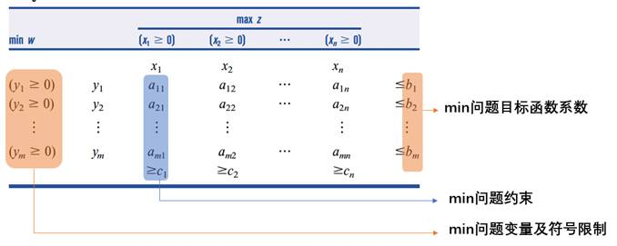

# 第4章 对偶理论和敏感度分析

这一章，我们将一线性规划问题设为原问题（primal problem），引入另一线性规划，称为该问题的对偶问题（dual problem），将介绍对偶问题的写法和对偶理论。对偶理论引出了一个新的求解算法——对偶单纯形法。最后我们引入了敏感度分析方法去探讨数据变化对求解结果的影响。

## 4.1 对偶问题

### 4.1.1 对偶问题的理解

线性规划里，每个原始线性规划问题，即**原问题（primal problem）**都有相应的另一个线性规划问题——**对偶问题（dual problem）**，而对偶的对偶又是原问题本身。既然我们已经知道用单纯形法去求解原问题了，为什么还要了解它的对偶问题呢？哪些情况下，考虑对偶问题有助于求解原问题？下面我们从两个角度阐述。

**1.**   **经济学角度**

这是一个在教材上被广泛使用的解释：如果原问题是企业A拥有m种资源（有m个约束），计划生产n种产品（有n个变量），目标是最大化总收入；那么对偶问题就是，企业B想要收购这些资源，需要确定m种资源的报价（有m个变量），目标是最小化总成本，但企业A只有在卖资源的收益不低于卖产品的时候才会同意卖资源（n个约束）。

我们通过一个数值实例来进一步解释：

企业A生产书架、桌子和椅子三种产品，拥有48m³木材，20h制造工时，8h测试工时三项资源。已知：书架售价60元，生产一个书架需要8单位木材、4单位制造工时和2单位测试工时；桌子售价30元，生产一张桌子需要6单位木材、2单位制造工时和1.5单位测试工时；椅子售价20元，生产一把椅子需要1单位木材、1.5单位制造工时和0.5单位测试工时；求三种产品各生产多少数量时，企业A能够最大化总收入。

**原问题**的线性规划为：
$$
\begin{alignat}{2}\max\quad  & 60x_1+30x_2+20x_3 （卖出三种产品的总收入） 
\\\\\text{s.t.}\quad & 8x_1+6x_2+x_3\le48 （木材总量约束）
\\\\ \quad & 4x_1+2x_2+1.5x_3\le20 （制造工时总量约束）
\\\\ \quad & 2x_1+1.5x_2+0.5x_3\le8 （测试工时总量约束）
\\\\ \quad &x_1,x_2,x_3\ge0
\\\\\end{alignat}
$$
如果企业B想要收购木材、制造工时、测试工时这三样资源，就必须为每项资源报价，并且满足企业A愿意出让资源的条件，即让企业A获得不低于自己制造产品的收入。求三项资源的单位报价各为多少时，企业B能够最小化总成本。

那么，可以写出**对偶问题**的线性规划是：
$$
\begin{alignat}{2}\min\quad  & 48y_1+20y_2+8y_3 （收购三种资源的总成本） 
\\\\\text{s.t.}\quad & 8y_1+4y_2+2y_3\ge60 （把足够制造一个书架的资源卖掉，获得的收入必须不低于书架售价）
\\\\ \quad & 6y_1+2y_2+1.5y_3\ge30 （把足够制造一张桌子的资源卖掉，获得的收入必须不低于桌子售价）
\\\\ \quad & y_1+1.5y_2+0.5y_3\ge20 （把足够制造一把椅子的资源卖掉，获得的收入必须不低于椅子售价）
\\\\ \quad &y_1,y_2,y_3\ge0 （分别是一单位木材、制造工时和测试工时的报价）
\\\\\end{alignat}
$$
上面的例子，旨在从实际经济问题的角度解释**「每一个线性规划问题都存在一个与其对偶的问题」**这句话的合理性。

**2.**   **数学角度**

从数学角度，对偶问题可以被理解为**寻找原问题目标函数上界（或下界）**的问题。

以原问题是求**目标函数最大化**为例，我们以向量形式写线性规划：
$$
\begin{alignat}{2}\max\quad  z=\textbf{cx} \\\\\text{s.t.}\quad A\textbf{x} \le \textbf{b} \\\\\textbf{x} \geq 0  &{}& \\\\\end{alignat}
$$
其中$\textbf{c}$为$1\times n$向量，$\textbf{x}$为$n\times 1$向量，$A$为$m\times n$矩阵，$\textbf{b}$为$m\times 1$向量。

对于任意一个非负的$n\times1$向量$\textbf{y}\ge0$和可行解$\textbf{x}$，原问题约束两边同乘$\textbf{y}^T$，有：
$$
\textbf{y}^TA\textbf{x} \le \textbf{y}^T\textbf{b}
$$
如果找到一个$\textbf{y}^T$满足$$c\le\textbf{y}^TA$$，那么对所有可行解$$\textbf{x}$$，都有：
$$
\textbf{cx}\le\textbf{y}^TA\textbf{x}\le\textbf{y}^T\textbf{b}
$$
这意味着，$$\textbf{y}^T\textbf{b}$$就是**原问题的一个上界**。

换言之，所有满足$$c\le\textbf{y}^TA$$的$$\textbf{y}$$对应的$$\textbf{y}^T\textbf{b}$$，都是原问题的上界。

那么，最小的上界就是原问题目标函数的最优值。在所有的上界中，我们要找到最小的那一个，这个问题表述出来就是：
$$
\begin{alignat}{2}\min\quad  w=\textbf{b}^T\textbf{y}\\\\\text{s.t.}\quad A^T\textbf{y} \le \textbf{c}^T \\\\\textbf{y} \geq 0  &{}& \\\\\end{alignat}
$$
可以发现，**这就是对偶问题的形式**。反之，如果原问题是求目标函数最小化，那么对偶问题就是在寻找原问题目标函数的下界。**图4.1**可以帮助理解：26是目标函数最优值，两个问题**分别从左右两侧逼近最优值**。

图4.1 原问题和对偶问题从两侧逼近最优解

3.**结合两个角度的解释**

依然从刚才的例子出发，现在有一组生产方案满足原问题约束，对应企业A总收入是$\bar{z}$；有一组报价满足对偶问题约束，对应企业B总成本是$\bar{w}$。

一定有$\bar{z}\le\bar{w}$，也就是企业B付出的总成本一定不低于企业A的总收入（这是对偶问题的约束，所以一定成立）。

也就是说，在这个例子里，对偶问题的任意一个可行解，都是原问题的一个上界。因为企业B用这组报价可以买到资源，所以企业A制造产品的收入不可能高于这组报价对应的成本。

当我们找到企业B所有报价里总成本最低的那一组，就是企业A能获得的总收入的最大值，是原问题的最优解。

### 4.1.2 对偶问题的优势

接下来我们考虑，同样是求解线性规划，解对偶问题就会比解原问题更容易吗？或者说，什么情况下，考虑对偶问题有助于求解原问题？

**1.**   **原问题约束多、变量少时，求解对偶问题能够降低计算时间**。

使用单纯形法时，如果原问题约束多变量少，转换成对偶问题，就是约束少变量多。根据单纯形法的原理，约束的减少能够有效降低计算时间。

**2.**   **帮助证明原问题无解**。

类似“证明无罪比证明有罪更难”，要证明原问题有解，只需要找出一个满足约束的点，却不能通过遍历所有的点来证明原问题无解。对偶问题的出现为证明原问题无解提供了思路。

**3.**   **便于进行敏感度分析**。

很多时候我们对原问题的好奇心并不仅限于得到最优解，而是还关注「如果某些已知条件发生变化，对最优解的影响程度如何」，这就是敏感度分析。对偶问题和敏感度分析息息相关：一是增加敏感度分析的直观程度（例如，对偶问题的最优解就是原问题约束的影子价格），二是在改变某些条件导致原问题无可行解时，可以借助仍然有可行解的对偶问题来分析。

### 4.1.3 对偶问题的表达

上两小节我们解释了「**为何引入对偶问题**」，这一节将阐述**对偶问题的表达**，即已知原问题时，如何快速写出对偶问题。先介绍一般形式的对偶问题写法，再介绍如何将非一般形式转化为一般形式，最后总结。

**1.**   **一般形式的对偶问题**

以目标函数最大化问题为例，**原问题的一般形式**指的是变量全部非负、约束全部为小于等于约束的线性规划，向量形式如下：
$$
\begin{alignat}{2}\max\quad  z=\textbf{cx} \\\\\text{s.t.}\quad A\textbf{x} \le \textbf{b} \\\\\textbf{x} \geq 0  &{}& \\\\\end{alignat}
$$
根据上一小节内容，其对偶问题的含义是：在原问题目标函数的所有上界中，找到最小的一个。相应**对偶问题的一般形式**，指的是变量全部非负、约束全部为大于等于约束的线性规划，向量形式如下：
$$
\begin{alignat}{2}\min\quad  w=\textbf{b}^T\textbf{y} \\\\\text{s.t.}\quad A^T\textbf{y} \le \textbf{c}^T \\\\\textbf{y} \geq 0  &{}& \\\\\end{alignat}
$$
在向量形式中，可以直观看出原问题和对偶问题的系数存在对应关系，例如：原问题目标函数的系数向量的转置$\textbf{c}^T$，是对偶问题约束的右侧向量；原问题约束的系数矩阵的转置$A^T$，是对偶问题约束的系数矩阵。借用上一节的实例，对应关系如图4.2： 

图4.2 原问题与对偶问题对应关系

如果我们面对的是一般形式问题，可以使用**表格法**便捷地写出对偶问题。图4.3中，**由上至下按行读**是**原问题**的约束和目标函数，**由左至右按列读**是**对偶问题**的约束和目标函数。

(a)标示max问题

(b) 标示min问题

图4.3 表格法写对偶问题

**2.**   **非一般形式的对偶问题**

实际中我们常常会遇到非一般形式的线性规划问题，在应用表格法之前需要先**对变量和约束的形式进行转化**（以目标函数最大化问题为例）：

①如果有$\ge$约束，则左右同乘-1，转化为$\le$约束；

②如果有$=$约束，则先转换为一个$\le$约束和一个$\ge$约束，再按①把$\ge$约束转换为$\le$约束。例如，如果存在约束$x_1+x_2=2$，等价于同时满足$x_1+x_2 \le 2$和$x_1+x_2\ge2$，后者再写成$-x_1-x_2\le-2$。

③如果有无符号限制(unrestricted in sign, urs)的变量，用两个符号限制为$\ge0$的变量相减表示，转换关系为：$x(x\quad urs)=x^{'}-x^{''}(x^{'},x^{''}\ge0)$。

**3.   总结**

将原问题转换为对偶问题的通用步骤归纳如下：①将原问题转换为标准形式；②由上至下逐行写原问题一般形式的变量及符号限制、约束和目标函数；③根据对应关系表确定对偶问题的**约束符号和变量符号**；④由左至右逐列读，得到对偶问题的变量及符号限制、约束和目标函数。

表格法中，**原问题和对偶问题的符号对应关系**可参考表4.1。（由于对偶的对偶是原问题，所以当原问题是最小化问题时，对应关系同样适用）

表4.1 原问题与对偶问题对应关系

| **原问题**       |                         |                           | **对偶问题**     |
| ---------------- | ----------------------- | ------------------------- | ---------------- |
| 变量向量         | $\textbf{x}(n\times1)$  | $\textbf{y}(m\times1)$    | 变量向量         |
| 目标函数方向     | max                     | min                       | 目标函数方向     |
| 目标函数系数向量 | $\textbf{c}(1\times n)$ | $\textbf{b}^T(1\times m)$ | 目标函数系数向量 |
| 约束系数矩阵     | $A(m\times n)$          | $A^T(n\times m)$          | 约束系数矩阵     |
| 约束右侧常数向量 | $\textbf{b}(m\times 1)$ | $\textbf{c}^T(n\times 1)$ | 约束右侧常数向量 |
| 变量符号         | $\ge0$                  | $\ge c_i$                 | 约束符号         |
|                  | $\le0$                  | $\le c_i$                 |                  |
|                  | urs                     | $=c_i$                    |                  |
| 约束符号         | $\le b_i$               | $\ge 0$                   | 变量符号         |
|                  | $\ge b_i$               | $\le 0$                   |                  |
|                  | $=b_i$                  | urs                       |                  |

本章到目前已经回答了「**为什么要引入对偶问题**」以及「**如何写对偶问题**」，下一节的主题是对偶原理，回答的问题是「**为什么原问题和对偶问题具有相同的最优解**（在有最优解的前提下）」，在证明的过程中，也会发现线性规划的一些其他性质。

## 4.2 对偶原理

## 4.3 对偶单纯形法

## 4.4 敏感度分析

## 本章参考文献

[1] L Winston, Wayne & B Goldberg, Jeffrey. (2004). Operations research: applications and algorithms.

[2] Frederick S. Hillier, Gerald J. Lieberman. Introduction to Operations Research (9th).

[3] Vijay V. Vazirani. (2003). Approximation Algorithms.

[4] 为什么我们要考虑线性规划的对偶问题？-知乎https://www.zhihu.com/question/26658861
