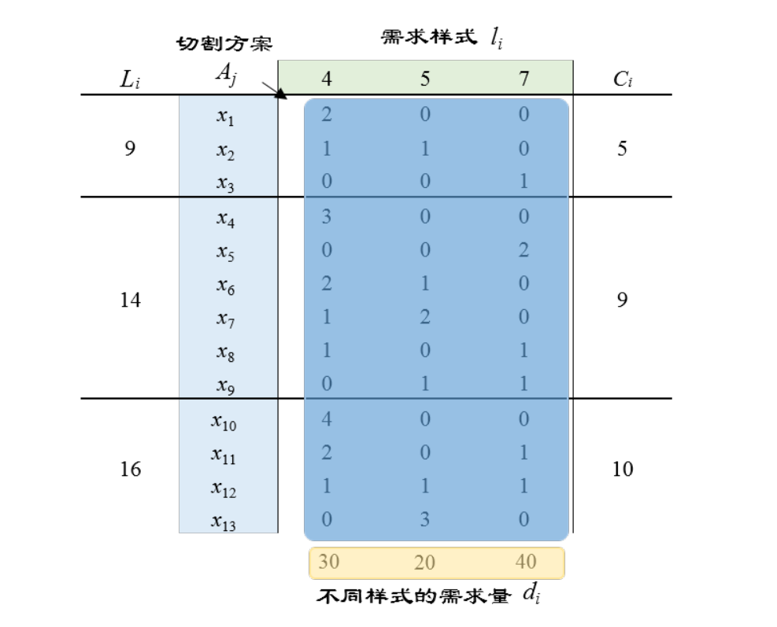
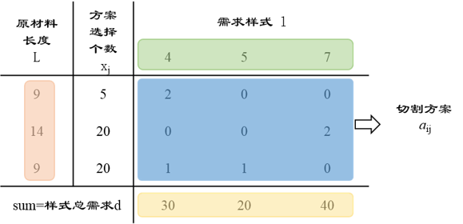

# 第5章 大规模线性规划求解算法

经典的大规模线性规划求解算法有切平面法，列生成和Dantzig-Wolfe分解等，很多算法的应用场景都属于整数规划的范畴。在线性规划专题下，我们简单地给读者介绍列生成和Dantzig-Wolfe分解的原理，想要深入了解的读者可以阅读整数规划专题的相关内容。

## 5.1 列生成算法

列生成算法是基于单纯形法的基本思想改进而来的，要理好解列生成，前提条件是掌握好线性规划单纯形法和对偶问题等知识，主要是单纯形法中非基变量进基时检验数（reduced cost）的计算，对偶问题中的影子价格和对偶变量。遗忘了或者对这部分内容不熟悉的读者，可以往前阅读相关章节的内容。

### 5.1.1 引例

下面通过木料切割（Cutting Stock Problem）这一经典问题，介绍列生成算法。

**引例：**木材厂有3种不同长度的木料：9m,14m,和16m。这三种木料的成本价分别是5，9和10元。有顾客需要4m的木料30根，5m的木料20根以及7m的木料40根。如何切割木料，使得既能满足顾客需求，又能使成本最少？

对这样一个小型算例，我们不妨试着枚举一下，这三种长度的木料（9,14,16）一共可以有多少种满足顾客需求（4,5,7）的切割方式。图5.1列出了13种可行的切割方案$A_j$，$A_j$是个三维的列向量，表示每个方案关于三种需求样式的切割次数，每个切割方案的数量用$x_j$表示（注意，此处仅考虑物料浪费最少的切割方案，故并非所有方案）。L表示每种切割方案所用原材料的长度：L=(9,14,16)T，而C对应每种切割方案的成本：C=(5,9,10)T，与原材料长度相关；*l*表示不同的需求样式：*l*=(4,5,7)T；*d*表示不同样式的需求量：*d*=(30,20,40)T。我们举个例子，切割方案 = (2, 0, 0)T表示原材料9m长的木棒，可被切割成2个4m长的木料。

图5.1  满足需求的切割方案

对该物料切割问题建立线性规划模型：

式（5.1）
$$
\min \sum_{i=j}^{13}{c_jx_j}\\
\mbox{s.t.}\quad
\sum_{i=j}^{13}{a_{ij}x_j\geq d_i}\quad i\in \{1,2,3\}\\ 
\ x_j \in Z^{+} \quad j\in\{1,2,...,13\}
$$
式中，$x_j$表示第*j*种方案的数量，取值为正整数；$a_{ij}$表示第j种方案中需求样式i的个数，其中i取值为1，2，3，分别表示4m、5m和7m的需求样式。

我们依然能用单纯形法求解上述模型。先不谈单纯形法求解该模型的效率，仅从需要枚举所有的切割方案$x_j$这一操作，就能知道上述求解方法一定不是最优的。而且上述枚举法存在以下缺点：

-  当原材料长度增加时，切割方案呈指数式增长，我们无法枚举所有的$x_j$；

- 枚举出来的切割方案可能会剩余过多的木料，这种方案通常不会被选择。

单纯形法要求我们列出所有的变量（$x_j$）。回忆一下，单纯形法在每次迭代的过程中，只能用**一个非基变量替换一个基变量**，而最终的**基变量个数仅与约束条件的数量**有关。这么看来，有大部分的$x_j$是不会被用到的（也就是说这些方案都不够好）。因此，我们不需要，也没必要列出所有的$x_j$；再者，对于大规模的问题，我们无法列出满足条件的所有变量。基于此，有学者就提出了求解大规模线性规划的高效算法 —— 列生成法，主要适用于**变量数目（列）大于约束条件个数（行）**的线性规划问题。

### 5.1.2 列生成

列生成算法的主要思想是对那些无法列出所有变量的原问题（master problem，MP），先考虑有限变量的主问题restricted master problem (RMP)，其余变量在有需要的时候，再添加到RMP中。什么变量是需要被加入到RMP中的呢？在单纯形法中，我们根据非基变量检验数的正负来选择进基变量；在列生成中，我们通过子问题（subproblem）来寻找满足reduced cost条件的变量，如果找到的话，就将它加入到RMP中，直至找不到为止，那么MP就求得了最优解。

对5.1.1的引例，我们已经列出了包含13种切割方案的master problem，即式(5.1)。假设初始只考虑3种切割方案(可以与图5.1中列举的方案不一致，如仅考虑9m长原材料的以下三种切割样式$x_1$、$x_2$和 $x_3$,分别取$A_1$=(2,0,0)T、$A_2$=(0,1,0)T和$A_3$=(0,0,1)T，可得到RMP(5.2)。在式(5.2)中，变量的整数约束松弛成了非负约束。

RMP(5.2):
$$
\min {5x_1+5x_2+5x_3}\\
\mbox{s.t.}\quad 
2x_1\geq 30\\
x_2\geq 20\\
x_3\geq 40\\
x_1,x_2,x_3 \geq 0
$$
Subproblem的构建依赖于求解RMP得到的对偶变量，也就是影子价格**w**。获得对偶变量有两种方法：一是通过求RMP的对偶问题获得，二是通过RMP问题中的$C_BB^{-1}$计算得到。基于检验数的计算公式，可以得到Subproblem的目标函数，即
$$
\max \sigma_j = z_j - c_j = C_BB^{-1}A_j-c_j = \sum_{i=1}^{m}{w_ia_{ij}-c_j}\quad i\in\{1,2,3\}
$$

若$max$ ${\sigma_j}>0 $ ，则$A_j$可以加到RMP的约束条件中，变量加$x_j$到目标函数中；若  $max$ ${\sigma_j}\leq0 $，则RMP的当前解已是最优解。

Subproblem的约束条件如下:
$$
\mbox{s.t.}\quad 
\sum_{i=1}^{3}{l_ia_{ij}}\leq{L_i}\\
a_i \geq 0 \quad \ x_j \in Z^{+}
$$
不难理解，影子价格**w**指的是满足顾客需求可获得的价值，那么子问题目标函数的含义可以理解为新切割方案带来的利润，所以只要使利润大于0的切割方案才能被加到RMP中。子问题的个数一般取决于原材料的类型，求解一个子问题能够得到一个切割方案$A_j$。约束条件表示当前切割方案要足原材料的要求。Cutting Stock Problem这类问题的subproblem其实是个背包问题，可以用动态规划等方法求解。对车辆路径问题（Vehicle Routing Problem, VRP）而言，它的子问题是最短路问题。可见，列生成算法可以将规模庞大的原问题分解成规模较小的RMP以及一个经典的，有成熟求解算法的线性规划子问题。求解这两个问题的难度将远远小于求解原问题的难度。

接下来，我们用列生成算法求解引例。

**Iteration 1**：基于RMP(5-2), 用单纯形法可求得$X^*$ = (15,20,40)T, $Z^*$ = 375，影子价格 **w** = $C_BB^{-1}$ = (2.5,5,5). 设新加入的列为$A_4$ = ($a_{14}$,$a_{24}$,$a_{34}$ )T，构造Subproblem。本算例中有三种不同长度的原材料L=(9, 14, 16)T，对应三种不同的成本C=(5,9,10)T，因此这里有三个子问题。

Subproblem 1:
$$
\max {2.5a_{14}+5a_{24}+5a_{34}-\textbf{5}}\\
\mbox{s.t.}\quad 
4a_{14}+5a_{24}+7a_{34}\leq \textbf{9}\\
\ a_{ij} \in Z^{+}
$$
Subproblem 2:
$$
\max {2.5a_{14}+5a_{24}+5a_{34}-\textbf{9}}\\
\mbox{s.t.}\quad 
4a_{14}+5a_{24}+7a_{34}\leq \textbf{14}\\
\ a_{ij} \in Z^{+}
$$
Subproblem 3:
$$
\max {2.5a_{14}+5a_{24}+5a_{34}-\textbf{10}}\\
\mbox{s.t.}\quad 
4a_{14}+5a_{24}+7a_{34}\leq \textbf{16}\\
\ a_{ij} \in Z^{+}
$$
求得三个子问题的解如下：

Subproblem 1:  $A_4$ = (1,1,0)T ,  $\sigma_4 = 2.5$.

Subproblem 2:  $A_4$ = (1,2,0)T ,  $\sigma_4 = 3.5$.

Subproblem 3:  $A_4$ = (0,3,0)T ,  $\sigma_4 = 5.$

三个子问题的检验数都大于0，我们取检验数最大的子问题的解 $A_4$ = (0,3,0)T加入RMP(5.2)中。

**Iteration 2**：   式(5-2)加入了新的切割方案$A_4$后，得到新的RMP(5.3)如下：

RMP(5.3):
$$
\min {5x_1+5x_2+5x_3+\textbf{10}x_4}\\
\mbox{s.t.}\quad 
2x_1\geq 30\\
x_2+\textbf{3}x_4\geq 20\\
x_3\geq 40\\
x_1,x_2,x_3,x_4 \geq 0
$$
切割方案$A_4$对应原材料为16m的木棒，切割成本为10元。可求得$X^*$ = (15,0,40,20/3)T, $Z^*$ = 341.7，影子价格 **w** =$C_BB^{-1}$ = (2.5,10/3,5). 设新加入的列为$A_5$ = ($a_{15}$,$a_{25}$,$a_{35}$ )T ,构造Subproblem.

Subproblem:
$$
\max \quad{2.5a_{15}+10/3a_{25}+5a_{35}-c_j}\\
\mbox{s.t.}\quad 
4a_{15}+5a_{25}+7a_{35}\leq L_i\\
\ a_{ij} \in Z^{+}
$$
第二次迭代中同样有三个子问题，其中$c_j\in\{5,9,10\}$,$L_i\in\{9,14,16\}$.

求得三个子问题的解如下：

Subproblem 1:  $A_5$ = (0,0,1)T ,  $\sigma_5 = 0$.

Subproblem 2:  $A_5$ = (0,0,2)T ,  $\sigma_5 = 1.$

Subproblem 3:  $A_5$ = (0,0,3)T ,  $\sigma_5 = 0$.

三个检验数中只有Subproblem 2的检验数大于0，故将 $A_5$ = (0,0,2)T加入到新的RMP中。

**Iteration 3**：   式(5.3)加入了新的切割方案$A_5$后，得到RMP(5.4)如下：

RMP(5.4):
$$
\min {5x_1+5x_2+5x_3+10x_4+\textbf{9}x_5}\\
\mbox{s.t.}\quad  
 2x_1\geq 30\\
x_2+3x_4\geq 20\\
x_3+\textbf{2}x_5\geq 40\\
x_1,x_2,x_3,x_4,x_5 \geq 0
$$
切割方案$A_5$对应原材料为14m的木棒，切割成本为9元。可求得$X^*$ = (15,0,0,20/3,20)T, $Z^*$ = 322，影子价格 **w** =$ C_BB^{-1}$ = (2.5,10/3,4.5). 设新加入的列为$A_6$ = ($a_{16}$,$a_{26}$,$a_{36}$ )T，构造Subproblem.

Subproblem:
$$
\max \quad{2.5a_{16}+10/3a_{26}+4.5a_{36}-c_j}\\
\mbox{s.t.}\quad 
4a_{16}+5a_{26}+7a_{36}\leq L_i\\
\ a_{ij} \in Z^{+}
$$
求得三个子问题的解如下：

Subproblem 1:  $A_6$ = (1,1,0)T ,  $\sigma_6 = 5/6.$

Subproblem 2:  $A_6$ = (1,2,0)T ,  $\sigma_6 = 1/6$.

Subproblem 3:  $A_6$ = (0,3,0)T ,  $\sigma_6 = 0$.

三个检验数中Subproblem 1的检验数最大，将该检验数对应的切割方案 $A_6$ = (1,1,0)T加入到新的RMP中。

**Iteration 4**：   式(5.4)加入了新的切割方案$A_6$后，得到新的RMP(5.5)如下：

RMP(5.5):
$$
\min {5x_1+5x_2+5x_3+10x_4+9x_5+\textbf{5}x_6}\\
\mbox{s.t.}\quad  
 2x_1+\textbf{1}x_6\geq 30\\
x_2+3x_4+\textbf{1}x_6\geq 20\\
x_3+2x_5\geq 40\\
x_1,x_2,x_3,x_4,x_5,x_6 \geq 0
$$
切割方案$A_6$对应原材料为9m的木棒，切割成本为5元。可求得$X^*$ = (5,0,0,0,20,20)T, $Z^*$ = 305，影子价格 **w** =$ C_BB^{-1}$ = (2.5, 2.5 ,4.5). 设新加入的列为$A_7$ = ($a_{17}$,$a_{27}$,$a_{37}$ )T，构造Subproblem.

Subproblem:
$$
\max \quad{2.5a_{17}+2.5a_{27}+4.5a_{37}-c_j}\\
\mbox{s.t.}\quad 
4a_{17}+5a_{27}+7a_{37}\leq L_i\\
\ a_{ij} \in Z^{+}
$$
求得三个子问题的解如下：

Subproblem 1:  $A_7$ = (0,0,1)T ,  $\sigma_7 = -0.5$.

Subproblem 2:  $A_7$ = (0,0,2)T ,  $\sigma_7 = 0$.

Subproblem 3:  $A_7$ = (0,0,2)T ,  $\sigma_7 = -1$.

当前子问题的检验数均小于等于0，所以X* = (5,0,0,0,20,20)T是RMP(5.5)的最优解。具体方案如下：方案①：将5根9m长的原材料各切成2个4m,；方案②：将20根14m长的原材料各切成2个7m；方案③：将20根9m长的原材料各切成一个4m和一个5m。

图5.2  切方案

### 5.1.3 延伸

除了经典的Cutting Stock Problem，旅行商问题（Travelling salesman problem, TSP），车辆路径问题（Vehicle Routing Problem, VRP），车间调度问题（scheduling）等都可以用列生成算法求得下界。本算例的计算过程都是手动计算的，如果有读者想要了解关于调用求解器求解列生成的算例，可查询参考文献[1-3]

## 5.2 Dantzig-Wolfe分解

### 参考文献

[1]  [【学界/编码】从下料问题看整数规划中的列生成方法_附Gurobi求解器源代码](https://zhuanlan.zhihu.com/p/32718222 )

[2] [干货 | 10分钟带你彻底了解column generation（列生成）算法的原理附java代码](https://www.jianshu.com/p/efb59a5d1b13 )

[3]  [开源的Julia实例给出了column generation求解Cutting Stock Problem的详细步骤](https://www.juliaopt.org/notebooks/Chiwei%20Yan%20-%20Cutting%20Stock.html)

